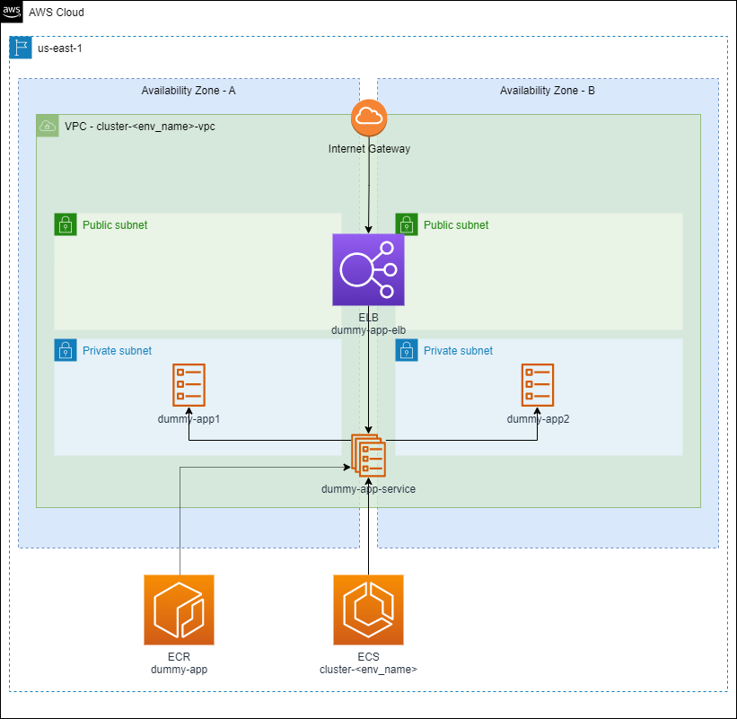
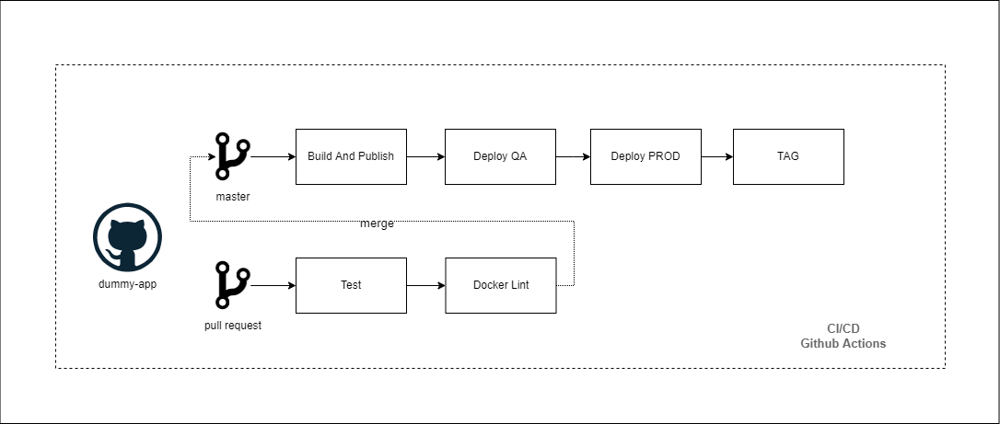

## Dummy APP
This is a simple project to deploy an Node.js application, using Github Actions, Terraform Cloud and Amazon. 

### Architecture
The following image is the architecture definition. Basically, the app is deployed in an ECS environment where each environment has it own VPC, Subnets, ELB and other resources. The container images are saved in a ECR repo.

### CICD Definition
The image below shows de Github Action definition for each workflow. 
1. Build and Publish the container image.
2. Generate a new task definition version with the new container version, and deploy it.
3. Promote task definition deployed on QA env to PROD. This steps require manual approval.
4. Tag the repo.

